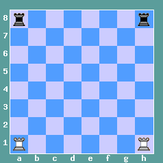
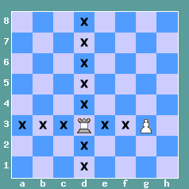
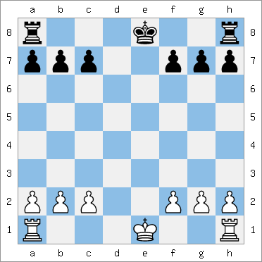
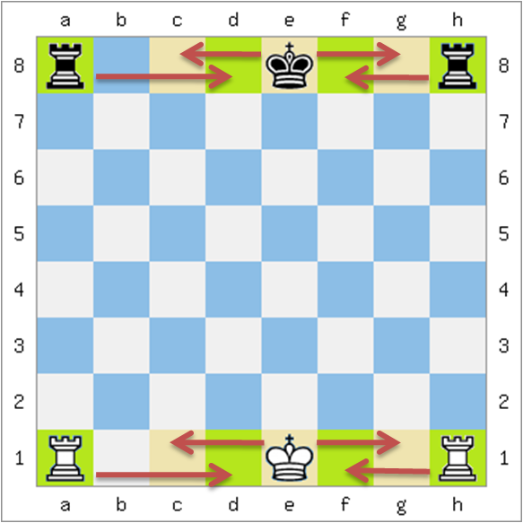
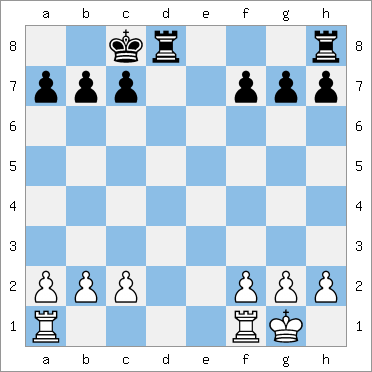
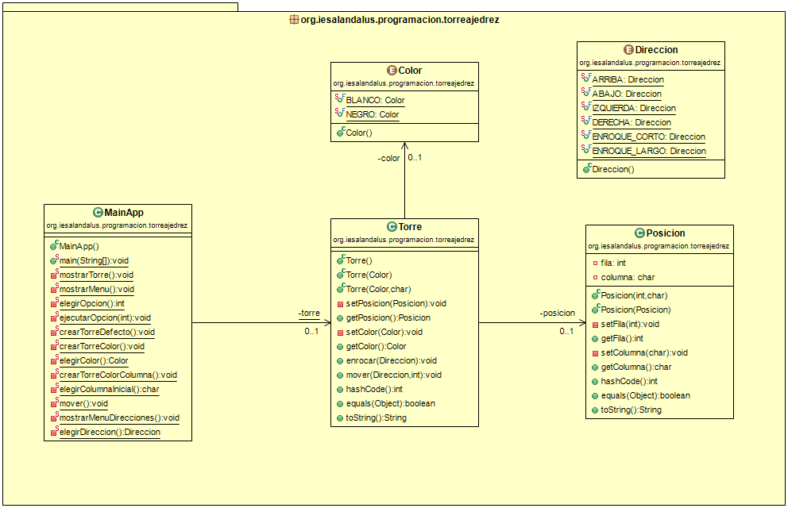

# Tarea Torre Ajedrez
## Profesor: Andrés Rubio del Río
## Alumno:

La tarea va a consistir en modelar el movimiento de una torre de ajedrez por el tablero de dicho juego.

Imágenes obtenidas de la web: (https://www.123ajedrez.com/reglas-basicas/la-torre) (Enrique Moreno)

En la primera imagen puedes observar cuál es el posicionamiento inicial válido para las torres dependiendo de su color.

En la segunda imagen puedes apreciar cuáles son los movimientos válidos para una torre. Además, de estos movimientos mostrados en la imagen, otro posible movimiento de la torre es el conocido como enroque, pudiendo ser un enroque corto o un enroque largo:

Imágenes obtenidas de la web: (https://www.123ajedrez.com/reglas-basicas/enroque) (Enrique Moreno)

En este repositorio hay un esqueleto de proyecto gradle que ya lleva incluidos todos los test necesarios que el programa debe pasar.

Para ello te pongo un diagrama de clases para el mismo y poco a poco te iré explicando los diferentes pasos a seguir:

1. Lo primero que debes hacer es un `fork` del repositorio donde he colocado el esqueleto de este proyecto.
2. Clona tu repositorio remoto recién copiado en GitHub a un repositorio local que será donde irás realizando lo que a continuación se te pide. Modifica el archivo `README.md` para que incluya tu nombre en el apartado "Alumno". Realiza tu primer commit.
3. Crea un enumerado llamado `Color`, dentro del paquete adecuado, que contenga los valores: `BLANCO` y `NEGRO`. Realiza un commit.
4. Crea un enumerado llamado `Direccion`, dentro del paquete adecuado, que contenga los valores: `ARRIBA`, `ABAJO`, `IZQUIERDA`, `DERECHA`, `ENROQUE_CORTO`, `ENROQUE_LARGO`. Realiza un commit.
5. Crea la clase `Posicion`. Crea los atributos `fila` (int) y `columna` (char) con la visibilidad adecuada. Realiza un commit.
6. Crea los métodos `get` y `set` para los atributos. Recuerda que para el método `set` se debe tener en cuenta que los valores indicados sean correctos (las filas van del 1 al 8 -ambos inclusive- y las columnas de la 'a' a la 'h' -ambas inclusive-) y si no se lance una excepción del tipo `IllegalArgumentException` con el mensaje adecuado. En caso de que la posición no sea la correcta no deben modificarse los atributos. Realiza un commit.
7. Crea un constructor para esta clase que acepte como parámetros la fila y la columna y que los asigne a los atributos si son correctos. Si no son correctos debe lanzar una excepción del tipo `IllegalArgumentException` con el mensaje adecuado. Para ello utiliza los métodos set anteriormente creados. Realiza un commit.
8. Crea el constructor copia para esta clase. Realiza un commit.
9. Crea los métodos `equals` y `hashCode` para esta clase. Realiza un commit.
10. Crea el método `toString` que devolverá un `String` y será la representación de la fila y la columna de forma adecuada (fila=valorf, columna=valorc). Realiza un commit.
11. Crea la clase `Torre`, dentro del paquete adecuado, cuyos atributos serán un color (del tipo enumerado `Color`) y posicion (de la clase `Posicion`), con la visibilidad adecuada. Realiza un commit.
12. Crea los métodos `get` y `set` para cada atributo con la visibilidad adecuada. Estos métodos siempre comprobarán la validez de los parámetros pasados y si no son correctos deberá lanzar la excepción adecuada (`NullPointerException` o `IllegalArgumentException`) con el mensaje adecuado. Realiza un commit.
13. Crea un constructor por defecto para esta clase que cree una torre negra en la posición '8h'. Realiza un commit.
14. Crea un constructor para la clase que acepte como parámetro el color y que creará una torre de dicho color cuya posición será '1h' si es blanca o '8h' si es negra. Realiza un commit.
15. Crea un constructor para la clase que acepte como parámetros el color y la columna inicial. La columna inicial debe ser válida (de lo contrario debe lanzar la excepción `IllegalArgumentException` con un mensaje adecuado). Este constructor creará una torre del color dado y colocado en dicha columna ('a' o 'h') y cuya fila será la 1 si es blanca y la 8 si es negra. Realiza un commit.
16. Crea el método `mover` que acepte como parámetro una `Direccion` y la cantidad de pasos a mover en dicha dirección. Los pasos deben ser positivos y la dirección no puede ser nula o de lo contrario debe lanzar una excepción adecuada (`NullPointerException` o `IllegalArgumentException`) con el mensaje adecuado. Si no puede realizar dicho movimiento, debido a que la torre se sale del tablero, se debe lanzar una excepción del tipo `OperationNotSupportedException` con un mensaje adecuado y no modificará la posición de la torre. Realiza un commit.
17. Crea el método `enrocar` que acepte como parámetro una `Dirección` válida para enrocar teniendo en cuenta que: 
	1. En el enroque en el flanco de rey (enroque corto), las blancas mueven su rey desde e1 a g1 y la torre desde h1 a f1, y en el enroque en el flanco de dama (enroque largo) mueven su rey desde e1 a c1 y la torre desde a1 a d1.
	2. En el enroque en el flanco de rey (enroque corto), las negras mueven su rey desde e8 a g8 y la torre desde h8 a f8, y en el enroque en el flanco de dama (enroque largo) mueven su rey desde e8 a c8 y la torre desde a8 a d8.
18. Crea los métodos `equals` y `hashCode` para esta clase. Realiza un commit.
19. Crea el método `toString` que devuelva un `String` que será la representación de dicho objeto (color y posición). Realiza un commit.
20. Crea los diferentes métodos que se indican en el diagrama de clases para permitir que el método `main` nos muestre un menú que nos permitirá crear una torre por defecto, crear una torre de un color, crear una torre de un color en una columna inicial dada ('c' o 'f'), mover la torre y salir. Después de cada operación se nos mostrará el estado actual de nuestra torre. El menú se repetirá mientras no elijamos la opción salir. En todo caso se debe validar que todas las entradas al programa son correctas. Para ello implementa los siguientes métodos:
    1. `void mostrarTorre()`: mostrará por consola la representación de la torre representado por el atributo de clase `torre` (crea el atributo si aún no lo has hecho). Realiza un commit.
    2. `void mostrarMenu()`: mostrará por consola el menú con las diferentes opciones de nuestro programa. Realiza un commit.
    3. `int elegirOpcion()`: Nos mostrará un mensaje para que elijamos una opción del menú anteriormente creado y nos pedirá que introduzcamos por teclado la opción hasta que ésta sea valida. Devolverá la opción elegida. Realiza un commit.
    4. `Color elegirColor()`: Nos preguntará que elijamos un color mientras éste no sea válido y dependiendo de la opción elegida devolverá un color u otro. Realiza un commit.
    5. `char elegirColumnaInicial()`: Nos preguntará que elijamos la columna inicial mientras ésta no sea válida y devolverá la columna elegida. Realiza un commit.
    6. `void mostrarMenuDirecciones()`: Mostrará por consola un menú con las diferentes direcciones que podemos elegir. Realiza un commit.
    7. `Direccion elegirDireccion()`: Nos mostrará un mensaje para que elijamos una opción del menú anteriormente creado y nos pedirá que introduzcamos por teclado la opción hasta que ésta sea valida. Devolverá la dirección elegida. Realiza un commit.
    8. `void crearTorreDefecto()`: Asignará al atributo de clase torre una nueva instancia de una torre creada con el constructor por defecto. Realiza un commit.
    9. `void crearTorreColor()`: Asignará al atributo de clase torre una nueva instancia de una torre creada con el constructor al que le pasamos el color. Este método debe utilizar métodos ya implementados anteriormente. Realiza un commit.
    10. `void crearTorreColorColumna()`: Asignará al atributo de clase torre una nueva instancia de una torre creada con el constructor al que le pasamos el color y la columna inicial. Este método debe utilizar métodos ya implementados anteriormente. Realiza un commit.
    11. `void mover()`: Mostrará un menú con las posibles direcciones, nos preguntará por la dirección y la cantidad de pasos a mover y moverá la torre según esos parámetros. Este método debe utilizar métodos ya implementados anteriormente. Realiza un commit.
    12. `void ejecutarOpcion(int)`: Depediendo de la opción pasada como parámetro, actuará en consecuencia. Este método debe utilizar métodos ya implementados anteriormente. Realiza un commit.
    13. `void main(String[])`: Método principal de nuestra aplicación que deberá realizar lo que se pide en el apartado 20 y que debe apoyarse en los métodos anteriormente implementados. Realiza un commit y realiza el push a tu repositorio remoto en GitHub.

#### Se valorará:

    La indentación debe ser correcta en cada uno de los apartados.
    El nombre de las variables debe ser adecuado.
    Se debe utilizar la clase `Entrada` para realizar la entrada por teclado.
    El programa debe pasar todas las pruebas que van en el esqueleto del proyecto y toda entrada del programa será validada, para evitar que el programa termine abruptamente debido a una excepción.
    La corrección ortográfica tanto en los comentarios como en los mensajes que se muestren al usuario.
